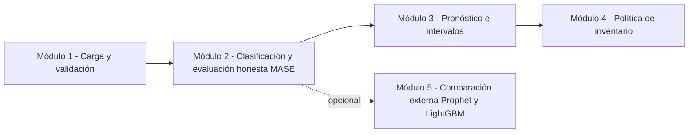

# Motor de Pronósticos — Tuboplex

<p align="center">
  
  
  
  
  
</p>

<p align="center">
Herramienta de <b>pronóstico de demanda</b> con clasificación estructural automática,
validación <b>honesta</b> (nunca se reporta una métrica calculada sobre los mismos
datos que eligieron el modelo), intervalos de predicción, política de inventario
derivada, y comparación opcional contra Prophet y LightGBM.
</p>

<p align="center">
  <a href="#inicio-rápido"><b>🚀 Inicio rápido</b></a> ·
  <a href="#cómo-funciona-el-pipeline"><b>🧭 Cómo funciona</b></a> ·
  <a href="#los-cinco-módulos-de-la-aplicación"><b>🖥️ Los 5 módulos</b></a> ·
  <a href="#estructura-del-repositorio"><b>📁 Estructura</b></a> ·
  <a href="#reproducir-los-resultados-del-manuscrito"><b>📊 Reproducir el paper</b></a> ·
  <a href="docs/MANUAL_USUARIO.md"><b>📘 Manual completo</b></a>
</p>

---

Este repositorio es un refactor completo de una versión previa que contenía
defectos estadísticos que invalidaban sus propios resultados publicados — ver
[`CHANGELOG.md`](CHANGELOG.md) y [`RESUMEN_EJECUCION.md`](RESUMEN_EJECUCION.md)
para el detalle hallazgo por hallazgo. El núcleo de pronóstico
(`codigo/forecasting_core/`) no depende de Dash ni de Plotly y es testeable de
forma independiente; toda la interfaz interactiva es una capa delgada sobre él.

## Índice

- [Inicio rápido](#inicio-rápido)
- [Cómo funciona el pipeline](#cómo-funciona-el-pipeline)
- [Estructura del repositorio](#estructura-del-repositorio)
- [Los cinco módulos de la aplicación](#los-cinco-módulos-de-la-aplicación)
- [Instalación](#instalación)
- [Ejecutar la aplicación](#ejecutar-la-aplicación)
- [Ejecutar las pruebas](#ejecutar-las-pruebas)
- [Reproducir los resultados del manuscrito](#reproducir-los-resultados-del-manuscrito)
- [Resultados versionados](#resultados-versionados)
- [Procesamiento por lotes (multi-SKU)](#procesamiento-por-lotes-multi-sku)
- [Limitaciones conocidas](#limitaciones-conocidas)
- [Licencia](#licencia)

## Inicio rápido

```bash
git clone https://github.com/GIUSEPPESAN21/Forecasting.git
cd Forecasting
python -m venv .venv && .venv\Scripts\activate    # Windows (ver Linux/Mac abajo)
pip install -r requirements.txt
python codigo/app.py
```

Abra `http://127.0.0.1:8050` en el navegador. En el **Módulo 1** presione
**"Cargar datos de ejemplo"** para probar toda la herramienta de inmediato,
sin preparar ningún archivo. Detalle completo, columna por columna y módulo
por módulo, en el **[manual de usuario](docs/MANUAL_USUARIO.md)**.

## Cómo funciona el pipeline

Regla de oro de todo el proyecto: **ninguna métrica se reporta jamás
calculada sobre los mismos datos usados para elegir el modelo o sus
hiperparámetros.** Por eso el walk-forward se parte en tres bloques
(*tuning* → *evaluación* → *externo*) antes de reportar un solo número — es
la corrección central de todo el refactor (ver `CHANGELOG.md`).



Cada nodo del diagrama es un módulo real de `python codigo/app.py` (ver
[Los cinco módulos](#los-cinco-módulos-de-la-aplicación) abajo). El Módulo 5
es opcional: solo se activa si instaló
[`requirements-external.txt`](requirements-external.txt).

## Estructura del repositorio

```
codigo/                         Todo el software
  forecasting_core/               Núcleo de pronóstico (sin dependencias de interfaz)
    data.py                         Carga y validación de series (F15)
    classification.py               Tendencia / estacionalidad / estacionariedad (F01, F10, F11)
    models.py                       Registro explícito de modelos (F04)
    metrics.py                      MASE primaria, MAPE seguro ante ceros, ME (F06, F12)
    validation.py                   Walk-forward de una sola pasada, con paridad (F02, F03, F14)
    optimize.py                     Tuning anidado y ganador sin sesgo de selección (F05, F13)
    intervals.py                    Intervalos de predicción empíricos (F20)
    inventory.py                    Stock de seguridad y punto de reorden (F20)
    batch.py                        Procesamiento multi-SKU con memoria acotada (F19)
  external_baselines/             Comparadores externos AISLADOS y OPCIONALES: Prophet,
                                   LightGBM (Fase 11, F27). No forman parte del núcleo ni
                                   de MODEL_REGISTRY; imports perezosos (ver Módulo 5).
  app.py                          Interfaz Dash (capa delgada sobre forecasting_core)
  batch_cli.py                    CLI de procesamiento por lotes multi-SKU (F19)
  tests/                          Suite pytest — 266 pruebas (ver más abajo)
  experimentos/                   Scripts de validación empírica y reproducibilidad

resultados/                    Evidencia versionada: CSV y logs de cada corrida citada
                                en el manuscrito (ver "Resultados versionados" abajo)

manuscritos/
  articulo_mdpi/                  Manuscrito LaTeX (MDPI, journal Forecasting) y figuras
  tesis_original/                 Documento de tesis original (Universidad de los Andes)

docs/                           Documentación de proceso y de uso
  MANUAL_USUARIO.md               Manual de uso completo — instalación a exportación
  prompt_maestro.md               Instrucción original, Fases 0-10 (F01-F25)
  prompt_maestro_fase11.md        Instrucción original, Fase 11 (F26-F29)
  comparacion_herramientas.pdf    PDF de los tutores que originó la Fase 11 (F26)
  auditoria_inicial.md            Auditoría que originó el refactor completo

requirements.txt                 Instalación mínima (núcleo + app)
requirements-external.txt        Opcional: Prophet + LightGBM (ver Módulo 5)
CHANGELOG.md                     Cada corrección, citada por ID de hallazgo (F01-F29)
RESUMEN_EJECUCION.md             Estado final de cada hallazgo, con evidencia
```

## Los cinco módulos de la aplicación

`python codigo/app.py` es **una sola página**: los módulos aparecen en orden
y cada uno se activa automáticamente cuando el anterior produce un
resultado. Resumen rápido abajo — el
**[manual de usuario](docs/MANUAL_USUARIO.md)** trae el detalle completo de
cada uno, con las preguntas frecuentes al final.

<a id="modulo-1"></a>
<details open>
<summary><b>Módulo 1 — Carga y validación de datos</b></summary>

Arrastre un Excel/CSV con columnas `year`, `month`, `demand` (y `sku`
opcional para varios productos), o presione **"Cargar datos de ejemplo"**
para probar la herramienta sin preparar ningún archivo. La carga acepta
meses numéricos o en texto (español/inglés), detecta sola el separador
decimal, y **nunca corrige nada en silencio**: todo hueco, duplicado o
ambigüedad se reporta explícitamente antes de continuar.

📘 [Ver el detalle completo del Módulo 1 →](docs/MANUAL_USUARIO.md#módulo-1--carga-y-validación-de-datos)
</details>

<a id="modulo-2"></a>
<details>
<summary><b>Módulo 2 — Clasificación estructural y evaluación honesta</b></summary>

Clasifica la serie (tendencia / estacionalidad / estacionariedad) con tests
estadísticos validados por Monte Carlo, filtra los métodos que no aplican
a esa estructura, y evalúa el resto por **MASE** sobre un bloque de datos
que nunca participó en la elección de hiperparámetros. La fila ganadora
queda resaltada; los métodos excluidos muestran el motivo exacto.

📘 [Ver el detalle completo del Módulo 2 →](docs/MANUAL_USUARIO.md#módulo-2--clasificación-y-evaluación-de-métodos)
</details>

<a id="modulo-3"></a>
<details>
<summary><b>Módulo 3 — Pronóstico con intervalos de predicción</b></summary>

Elija el horizonte (6 a 24 meses) y el nivel del intervalo (80/90/95%). La
banda de incertidumbre se calcula por cuantiles empíricos del error de
backtest — no asume normalidad. El pronóstico exportable a Excel nunca es
negativo.

📘 [Ver el detalle completo del Módulo 3 →](docs/MANUAL_USUARIO.md#módulo-3--pronóstico-con-intervalos)
</details>

<a id="modulo-4"></a>
<details>
<summary><b>Módulo 4 — Política de inventario</b></summary>

A partir del lead time y el nivel de servicio deseados, calcula demanda
esperada, stock de seguridad y punto de reorden — derivados de la
desviación del error **acumulado** sobre el lead time, no de una
aproximación ingenua.

📘 [Ver el detalle completo del Módulo 4 →](docs/MANUAL_USUARIO.md#módulo-4--política-de-inventario)
</details>

<a id="modulo-5"></a>
<details>
<summary><b>Módulo 5 — Comparación externa (Prophet / LightGBM) — opcional</b></summary>

Compara el método ganador contra **Prophet** y **LightGBM**, los tres sobre
el mismo bloque de evaluación externo (mezclar el error interno de un
método con el holdout de otro no es una comparación válida — es
exactamente el defecto que este módulo corrige, ver
[`decision_prophet.md`](codigo/experimentos/decision_prophet.md)). Requiere
`pip install -r requirements-external.txt`; sin ese paso el módulo se
muestra deshabilitado y **el resto de la app funciona exactamente igual**.

📘 [Ver el detalle completo del Módulo 5 →](docs/MANUAL_USUARIO.md#módulo-5--comparación-externa-prophet--lightgbm)
</details>

## Instalación

```bash
python -m venv .venv
.venv\Scripts\activate      # Windows
# source .venv/bin/activate # Linux/Mac
pip install -r requirements.txt
```

Probado con Python 3.11.9. Las versiones de librería están fijadas en
[`requirements.txt`](requirements.txt) a las usadas para producir los
resultados de `resultados/`.

### Dependencias opcionales para la comparación externa

`requirements.txt` es intencionalmente la instalación **mínima** para correr
el núcleo y la app. Prophet y LightGBM (Módulo 5, Fase 11 F27) son
comparadores externos aislados en `codigo/external_baselines/`, con su
propio archivo de dependencias:

```bash
pip install -r requirements-external.txt
```

Sin este paso, `codigo/app.py` y toda la suite `pytest` funcionan
exactamente igual (el Módulo 5 queda deshabilitado con un aviso, y
`codigo/tests/test_external_baselines.py` se salta automáticamente). Ver
[`decision_prophet.md`](codigo/experimentos/decision_prophet.md) para la
justificación completa de por qué estos paquetes viven aislados.

## Ejecutar la aplicación

```bash
python codigo/app.py
```

Por defecto corre en modo producción (`debug=False`). Para depurar:
`FORECASTING_DEBUG=true python codigo/app.py`. El nivel de log se controla con
`FORECASTING_LOG_LEVEL` (por defecto `WARNING`). Puerto configurable con la
variable `PORT` (por defecto `8050`) — ver el
[manual](docs/MANUAL_USUARIO.md#2-arrancar-la-aplicación) para los tres
formatos de shell.

## Ejecutar las pruebas

Desde la raíz del repositorio (`pytest.ini` ya apunta a `codigo/tests`):

```bash
pytest                       # suite completa, excluye pruebas lentas por defecto
pytest -m slow               # incluye el perfilado de memoria del lote
```

La suite cubre: potencia y tamaño de la clasificación estructural, métricas
(incluyendo MASE y el caso de demanda cero), ausencia de fuga temporal
(verificada programáticamente, no solo por inspección), paridad del
walk-forward, despacho exacto del registro de modelos, ausencia de sesgo de
selección de hiperparámetros, carga robusta de datos, memoria acotada del
procesamiento por lotes, y los adaptadores externos del Módulo 5 (se saltan
automáticamente sin `requirements-external.txt`). Estado actual: **266
pruebas, 265 passed, 1 skip preexistente sin relación con la Fase 11, 0
failed** — detalle en `CHANGELOG.md`, sección "Fase 11".

## Reproducir los resultados del manuscrito

Cada cifra cuantitativa de `manuscritos/articulo_mdpi/template.tex` proviene de
uno de estos scripts, ejecutable con un solo comando y semilla fija. Todos
escriben directamente en `resultados/`:

```bash
# Validación Monte Carlo de la clasificación estructural (Sección 2.3 del manuscrito)
python codigo/experimentos/montecarlo_clasificacion.py --reps 1000 --sizes 24 36 48 120

# Caso ilustrativo end-to-end (Sección 3.2 del manuscrito)
python codigo/experimentos/caso_ilustrativo.py

# Herramienta vs. método incumbente de Tuboplex (Sección 3.3)
python codigo/experimentos/vs_incumbente.py --synthetic --n-series 40 --seed 20260824
# Con el archivo real de la empresa:
python codigo/experimentos/vs_incumbente.py --input ruta/al/archivo.xlsx

# Validación sobre panel público M3-Monthly truncado (Sección 3.4)
python codigo/experimentos/panel_publico.py --n-series 150 --max-len 48 --seed 20260824

# Tiempos computacionales (Sección 3.5)
python codigo/experimentos/benchmark_tiempos.py --reps 5 --sizes 24 48 72 96 120

# Figuras del manuscrito (escriben en manuscritos/articulo_mdpi/figures/)
python codigo/experimentos/make_figures.py

# Comparación externa: Herramienta vs. Prophet vs. LightGBM (Fase 11, F26/F27)
# Requiere requirements-external.txt instalado; ver sección de instalación arriba.
python codigo/experimentos/comparativa_externa.py --seed 20260824

# Figuras de la comparación externa (F28; requiere el CSV anterior)
python codigo/experimentos/make_figures_comparativa.py
```

| Script | Figura(s) que produce | Sección del manuscrito |
|---|---|---|
| `make_figures.py` | `flowchart_tool.png`, `fig2_forecast_caso.png` | Metodología (Fig. 1), Caso ilustrativo (Fig. 2) |
| `make_figures_comparativa.py` | `fig_c1_boxplot_mase.png`, `fig_c2_mase_vs_longitud.png`, `fig_c3_panel_regimenes.png` | Comparación externa (Fase 12, pendiente de incorporar al manuscrito — ver `resultados/comparativa_externa.csv`) |

## Resultados versionados

A diferencia de un `.gitignore` que oculta toda salida de experimentos, los
CSV y logs finales usados en el manuscrito **sí están versionados** en
`resultados/`, como evidencia trazable de cada cifra publicada:

```
resultados/
  montecarlo_clasificacion.csv     1000 réplicas x 4 tamaños de serie
  caso_ilustrativo_ranking.csv       ranking del caso ilustrativo (Sección 3.2)
  caso_ilustrativo_pronostico.csv    pronóstico + intervalo del caso ilustrativo
  vs_incumbente.csv                 40 series, herramienta vs. incumbente vs. naive
  panel_publico.csv                 150 series M3-Monthly, protocolo de bloque externo
  benchmark_tiempos.csv             tiempos de pipeline por tamaño de serie
  comparativa_externa.csv           Herramienta vs. Prophet vs. LightGBM (Fase 11, F27):
                                     10 longitudes x 5 regímenes estructurales, protocolo
                                     de bloque externo único para los tres métodos
  logs/                             transcripciones de consola de cada corrida
```

Solo se excluye del control de versiones `codigo/experimentos/m3cache/`: el
caché del dataset público M3 descargado automáticamente por
`panel_publico.py` (reproducible desde su fuente original, no autorado).

## Procesamiento por lotes (multi-SKU)

Desde la línea de comandos, sin escribir Python:

```bash
python codigo/batch_cli.py productos.xlsx salida/ --horizon 12 --lead-time 3 --service-level 0.95
```

O desde código:

```python
from forecasting_core.batch import BatchConfig, run_batch
import pandas as pd

panel = pd.read_excel("productos.xlsx")  # columnas: sku, year, month, demand
run_batch(panel, "salida/", BatchConfig(horizon=12, lead_time=3, service_level=0.95))
```

Memoria acotada: los resultados se vuelcan a disco incrementalmente, no se
acumula el portafolio completo en memoria (ver
`codigo/tests/test_batch_memory.py`). Detalle de todas las opciones en el
[manual de usuario](docs/MANUAL_USUARIO.md#5-procesar-muchos-productos-a-la-vez-batch_clipy).

## Limitaciones conocidas

- Modelos univariados: no incorpora variables exógenas (p. ej. cartera
  adjudicada de proyectos de construcción).
- Los datos reales de Tuboplex no están incluidos (confidencialidad
  comercial); `codigo/experimentos/vs_incumbente.py` acepta el archivo real
  como reemplazo directo del panel sintético.
- Con menos de ~36 observaciones mensuales la estacionalidad no es
  identificable de forma confiable (ver `codigo/forecasting_core/classification.py`).
- El Módulo 5 (Prophet/LightGBM) es una línea base de comparación, no un
  modelo optimizado: ninguno de los dos recibió ajuste fino de
  hiperparámetros (ver [`decision_prophet.md`](codigo/experimentos/decision_prophet.md)).

## Licencia

MIT — ver [`LICENSE`](LICENSE).

---

<p align="center"><a href="#motor-de-pronósticos--tuboplex">↑ Volver al inicio</a></p>
